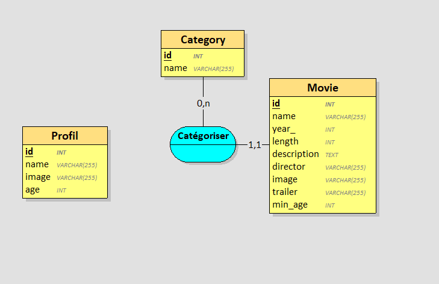

## Profil :

    Name varchar(255) car le nom du profil peut contenir des chiffres ou des caractères spéciaux.

    Image varchar(255) car le nom de l’image peut contenir des chiffres ou des caractères spéciaux.

    Age INT car l’âge et un nombre entier.

    Pour les liens entre category et movie, j'ai mis 0,n car une category peut avoir au minimum 0 film et au maximum n film

    Pour les liens entre movie et category, j'ai mis 1,1 car un film peut   avoir au minimum 1 category et au maximum 1 category